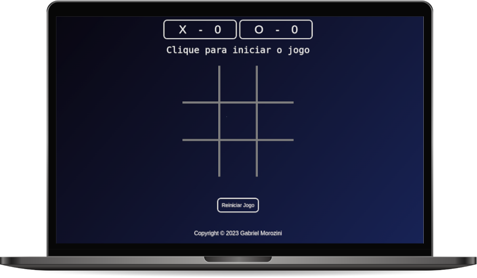

[Visualizar Página](https://gabrielmorozini.com.br/jogoDaVelha/)

## 📚 Sobre o projeto 
 
O jogo da velha é um jogo clássico e que possui origens antigas, além disso é conhecido em todo o mundo. No entanto, mesmo sendo um jogo simples, ele pode oferecer muita diversão e desafios para jogadores de todas as idades.

Recentemente, no curso Programador BR, foi desenvolvido um projeto para criar uma versão eletrônica do jogo da velha. O objetivo do projeto foi explorar os conceitos de programação e criar um jogo funcional e divertido.

A versão eletrônica do jogo oferece uma interface fácil de usar, com um visual agradável e uma jogabilidade intuitiva.

Este projeto foi uma excelente oportunidade para colocar em prática os conceitos de programação e criar algo útil e divertido ao mesmo tempo. 

 

## 🖥️ Tecnologias utilizadas

* HTML
* CSS
* JavaScript

 

## ✒️ Licença
Esse projeto está sob licença MIT. Leia o arquivo <a href="./license" >LICENSE</a> para mais detalhes. 

  

  
  
       

